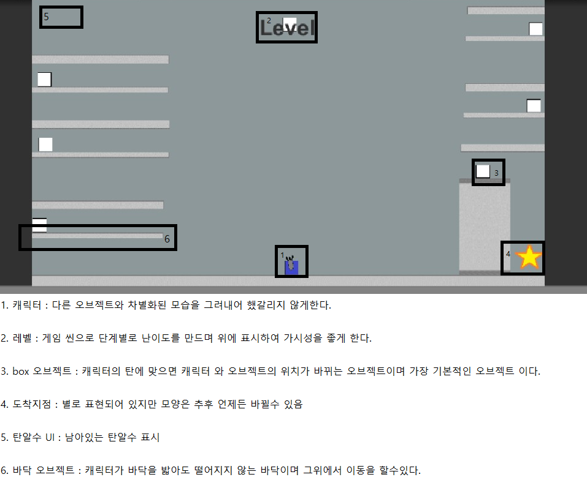

ChangeGun
=========
## [컨셉]

### 메인 컨셉 : 실험
*미지의 존재가 지구 생명체의 지능 테스트를 위해 종류별로 납치 하여 실험을 진행한다.

### 서브 컨셉1 : 체인지
*위치를 바꿀수 있는 총으로 오브젝트와 캐릭터의 위치를 변경하여 퍼즐을 진행할수 있다.

### 서브 컨셉2 : 교감
*위치를 바꾸는것 뿐만아닌 다른 생명체와 상호작응을 통하여 퍼즐을 해결할수 있다.

### 서브 컨셉3 : 상호작용
*무게를 이용하여 저울이 움직이는형태, 버튼을 이용한 퍼즐을 통해 상호작용해야 이어나갈수 있는 맵 디자인을 할 생각이다.

### 서브 컨셉4 : 제한된 물자
*탄은 무제한으로 제공하지 않으며 탄이 다 떨어지게 되면 진행을 할수 없다.

### 서브 컨셉5 : 숨겨진 길
*게임도중 메뉴얼과 다른 길이 존재한다.

### 서브 컨셉6 : 탈출
*최종 목표는 탈출이며 방법은 복수로 존재한다.

--------------
## 대표 이미지 & 작품 묘사

  

