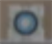

ChangeGun
=========
# [컨셉]

### 메인 컨셉 : 실험
*미지의 존재가 지구 생명체의 지능 테스트를 위해 종류별로 납치 하여 실험을 진행한다.

### 서브 컨셉1 : 체인지
*위치를 바꿀수 있는 총으로 오브젝트와 캐릭터의 위치를 변경하여 퍼즐을 진행할수 있다.

### 서브 컨셉2 : 교감
*위치를 바꾸는것 뿐만아닌 다른 생명체와 상호작응을 통하여 퍼즐을 해결할수 있다.

### 서브 컨셉3 : 상호작용
*무게를 이용하여 저울이 움직이는형태, 버튼을 이용한 퍼즐을 통해 상호작용해야 이어나갈수 있는 맵 디자인을 할 생각이다.

### 서브 컨셉4 : 제한된 물자
*탄은 무제한으로 제공하지 않으며 탄이 다 떨어지게 되면 진행을 할수 없다.

### 서브 컨셉5 : 숨겨진 길
*게임도중 메뉴얼과 다른 길이 존재한다.

### 서브 컨셉6 : 탈출
*최종 목표는 탈출이며 방법은 복수로 존재한다.

--------------
# 대표 이미지 & 작품 묘사

  

-------------

# 게임 오브젝트 분해 및 속성  

### 1.플레이어
  
1. 직접조종 : W,A,S,D
2. 체력 : 1
3. 이동속도 : 3.0
4. 중력 : 1

### 2.체인지건
  
1. 격발 : 마우스 좌클릭
2. 에임 추적 : 마우스 포인터 방향을 바라봄
### 3.탄
  
1. 직선이동
2. 이동속도 : 10
3. 위치변경 가능

### 4.박스
  
1. 중력 : 1
2. 위치변경 가능
### 5.벽/바닥
  
1. 통과불가

### 6.철망 벽/바닥
  
1. 부분 통과불가

### 7.버튼
  
1. 스위치 on/off

-------------

# 게임의 규칙 

## 1) 핵심 규칙

1. 다음 스테이지로 가는 문 오브잭트와 캐릭터의 오브잭트가 충돌한다.

## 2) 보조 규칙

1. 플레이어는 벽 오브잭트를 통과할수 없다
2. 탄 오브잭트가 충돌한 오브잭트와 플레이어 오브잭트의 위치를 바꾼다
3. 탄의 개수는 제한되어 있다.

---------------

# 게임에서 사용될 공식

### (1) Box 오브잭트와 플레이어 오브잭트의 좌표값을 저장해두고 탄 오브잭트가 충돌시 둘의 좌표값을 바꾼다. 
### (2) 탄은 스테이지 마다 개수가 다르며 0 일 경우 한번더 발사하게 되면 게임 오버가된다.
### (3) 장애물 오브잭트와 캐릭터가 충돌하면 게임 오버가 된다.
### (4) 캐릭터 오브잭트와 문 오브잭트가 충돌할 경우 다음 씬으로 넘어간다.(5) 탄 오브잭트의 이동방향은 마우스 버튼이 클릭이 된 곳으로 한다.
### (5) 탄 오브잭트의 이동방향은 마우스 버튼이 클릭이 된 곳으로 한다.

------------------

# 요구사항

ChangeGun 미션 요구사항

#### ● 시작화면, 플레이화면, 종료화면 세가지 화면이 있다.
#### ● 시작화면에는 시작하기 버튼이 있다
#### ● 시작하기 클릭시 게임이 플레이 화면으로 전환된다.
#### ● 플레이 화면에는 잔탄수 가 표시가 되며 캐릭터를 통해 문 을 향하여 이동한다.
#### ● 문을 통하여 다음 스테이지를 이동하며 마지막 문에서 문을 통과할시 종료화면으로 이동한다.
#### ● 종료화면은 시작화면으로 이동하는 버튼과 window로 종료하는 버튼까지 2개 존재한다.

--------------------

# 시간별 흐름도

------------------

